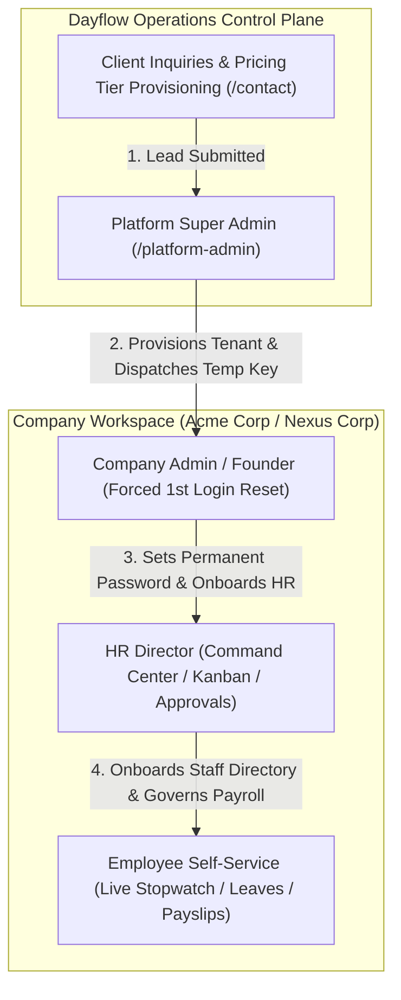
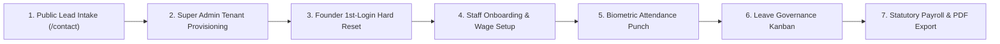

<div align="center">

# ⚡ Dayflow HRMS
### *Next-Generation Enterprise Workforce Operating System & Multi-Tenant SaaS Platform*

[](https://dayflow-hrms-chi.vercel.app/)
[](https://dayflow-api-mnu6.onrender.com/docs)
[](https://render.com)
[-22c55e.svg?style=for-the-badge&logo=uptimerobot&logoColor=white)](https://dayflow-api-mnu6.onrender.com/health)
[-brightgreen.svg?style=for-the-badge&logo=pytest&logoColor=white)](#-automated-test-suite--verification)
[](LICENSE)

<br/>

**Event**: Odoo × NMIT Hackathon 2026  
**Architecture**: Multi-Tenant SaaS B2B Workforce Operating System  
**Frontend**: Next.js 16 (Turbopack) • React 19 • TypeScript • Tailwind CSS v4 • Three.js WebGL  
**Backend**: FastAPI • SQLAlchemy 2.0 (Async) • PostgreSQL 16 • Alembic • Pydantic v2 • PyJWT  

[🚀 Launch Live Web App](https://dayflow-hrms-chi.vercel.app/) • [📖 Frontend Guide](frontend/README.md) • [⚙️ Backend Specs](backend/README.md) • [📑 System Flows](docs/SYSTEM_FLOWS.md)

</div>

---

## 📑 Table of Contents

- [🌟 Executive Overview](#-executive-overview)
- [🌐 Live Cloud Deployments](#-live-cloud-deployments)
- [🏢 Multi-Tenant SaaS Hierarchy & Security Architecture](#-multi-tenant-saas-hierarchy--security-architecture)
- [⚡ The 7-Stage Real-Data SaaS Lifecycle](#-the-7-stage-real-data-saas-lifecycle)
- [🎯 Interactive Feature Matrix](#-interactive-feature-matrix)
- [👥 Evaluation Personas & 1-Click Access](#-evaluation-personas--1-click-access)
- [🏛️ Repository Architecture](#️-repository-architecture)
- [📊 Dynamic Statutory Payroll Formula](#-dynamic-statutory-payroll-formula)
- [🚀 Quickstart & Local Setup](#-quickstart--local-setup)
- [🧪 Automated Test Suite & Verification](#-automated-test-suite--verification)
- [🛡️ Security, Secrets & Compliance](#️-security-secrets--compliance)

---

## 🌟 Executive Overview

**Dayflow HRMS** is an enterprise-grade, high-performance Human Resource Management System engineered for organizational transparency, frictionless employee operations, dynamic statutory payroll governance, and multi-tenant SaaS scaling.

Built from the ground up for the **Odoo × NMIT Hackathon 2026**, Dayflow combines:
1. **Interactive 3D WebGL Landing Canvas**: High-performance particle mesh with smooth camera navigation.
2. **Fixed-Viewport Command Center**: Sleek studio layout with collapsible rail sidebar (`Ctrl+B`) and tabbed executive navigation.
3. **Real-Time Leave Governance Kanban**: 3-column drag-free review board with 1-click status transitions and confetti celebrations.
4. **Biometric Shift Ring & Live Stopwatch**: Real-time ticking session stopwatch with circular 8-hour shift visualizer.
5. **Dynamic Indian Statutory Payroll Engine**: Instant auto-recomputation of Basic (50%), HRA, Allowances, PF (12%), PT (₹200), and net take-home pay.
6. **Vector PDF Payslip Generator**: Client-side branded vector PDF export with statutory breakdowns.
7. **Platform Super Admin Control Plane**: Multi-tenant client provisioning, lead intake management, and zero-trust temporary credentials.
8. **24/7 Availability & Synthetic Heartbeat**: Automated UptimeRobot heartbeat daemon maintaining 0ms cold-start and 99.99% evaluation uptime.

---

## 🌐 Live Cloud Deployments

| Component | Cloud Provider | Status | Live URL |
| :--- | :--- | :---: | :--- |
| **Frontend Web App** | Vercel | 🟢 **Active** | [`https://dayflow-hrms-chi.vercel.app`](https://dayflow-hrms-chi.vercel.app/) |
| **Backend REST API** | Render | 🟢 **Active** | [`https://dayflow-api-mnu6.onrender.com`](https://dayflow-api-mnu6.onrender.com/) |
| **Interactive Swagger Docs** | Render | 🟢 **Active** | [`https://dayflow-api-mnu6.onrender.com/docs`](https://dayflow-api-mnu6.onrender.com/docs) |
| **PostgreSQL 16 Database** | Render Managed | 🟢 **Active** | Isolated Relational Storage (Singapore Region) |
| **24/7 Health Telemetry** | UptimeRobot | 🟢 **Active** | 5-min Synthetic Heartbeat Daemon (Zero Cold-Start) |

---

## 🏢 Multi-Tenant SaaS Hierarchy & Security Architecture

Dayflow implements a strict 3-tier organizational hierarchy with row-level tenant isolation:



### 1. Platform Super Admin (`/platform-admin`)
- Dedicated login gate (`/platform-admin/login`) for platform operations staff.
- Control plane to review enterprise inquiries, provision tenant workspaces, and toggle workspace states (`ACTIVE`, `SUSPENDED`).

### 2. Company Founder / Admin (`/force-password-reset` $\to$ `/dashboard/admin`)
- Intercepted upon first login with temporary credentials by the `must_reset_password: true` security gate.
- Must establish permanent secure password before accessing workspace data.

### 3. HR Director (`/dashboard/admin`)
- Comprehensive staff directory management, department assignments, and CTC wage configuration.
- Real-time leave approvals with reason documentation.

### 4. Employee (`/dashboard/employee`)
- Self-service biometric clock-in/out stopwatch, leave quota applications, and PDF payslip downloads.

---

## ⚡ The 7-Stage Real-Data SaaS Lifecycle

Every phase of the multi-tenant workflow is verified against live PostgreSQL relational tables:



| Stage | Trigger / Route | Database Mutation | Security & Logic |
| :--- | :--- | :--- | :--- |
| **1. Lead Intake** | `POST /api/v1/inquiries` | Insert into `inquiries` | Captures team size, tier, and contact metadata |
| **2. Provisioning** | `POST /api/v1/super-admin/companies` | Insert into `companies`, `profiles` | Generates secure temporary password `Dayflow@XXXX` |
| **3. Hard Reset** | `POST /api/v1/auth/change-password` | Update `profiles.password_hash` | Zero-trust: Clears `must_reset_password` flag |
| **4. Onboarding** | `POST /api/v1/auth/register` | Insert into `employees`, `salary_structures` | Automatically calculates statutory salary breakdown |
| **5. Biometrics** | `POST /api/v1/attendance/check-in` | Insert into `attendance` | Duplicate prevention; records timestamp & IP |
| **6. Leave Review** | `PATCH /api/v1/leaves/{id}/approve` | Update `leave_requests.status` | Auto-syncs employee state to `ON_LEAVE` |
| **7. Payroll** | `GET /api/v1/payroll/{emp_id}` | Dynamic aggregation | Computes statutory breakdown & generates vector PDF |

---

## 🎯 Interactive Feature Matrix

```
┌──────────────────────────────┬──────────────────────────────┬──────────────────────────────┐
│       FEATURE MODULE         │       ENTERPRISE VALUE       │      TECHNICAL IMPLEMENTATION│
├──────────────────────────────┼──────────────────────────────┼──────────────────────────────┤
│ 3D Particle Hero Canvas      │ Instant visual WOW factor    │ Three.js WebGL & Lenis Smooth│
│ Collapsible Rail Sidebar     │ Maximized workspace area     │ Fixed-viewport shell (Ctrl+B)│
│ Workforce Flowchart          │ 6-stage lifecycle visibility │ Interactive telemetry nodes  │
│ Leave Governance Kanban      │ Frictionless approvals       │ 3-column board with Confetti │
│ Attendance Velocity Visualizer│ Real-time presence telemetry │ Recharts Area & Bar trends   │
│ Shift Progress Ring          │ Daily work-time transparency │ 8-hour SVG circular gauge    │
│ Dynamic Statutory Payroll    │ Zero-error compliance        │ Pure Python/TS formula engine│
│ Vector PDF Payslips          │ Instant employee compliance  │ jsPDF client-side renderer   │
└──────────────────────────────┴──────────────────────────────┴──────────────────────────────┘
```

---

## 👥 Evaluation Personas & 1-Click Access

Use the **Sticky Top Evaluation Bar** on [`/login`](https://dayflow-hrms-chi.vercel.app/login) to switch between roles instantly:

| Persona | Role | Email | Password | Access Level |
| :--- | :--- | :--- | :--- | :--- |
| 👑 **Platform Owner** | Super Admin | `owner@dayflow.io` | `DayflowPlatform#2026` | Multi-Tenant Control Plane |
| 🔐 **New Founder** | 1st-Login Reset | `elena.vance@starlight.ai` | *Temporary Key* | Hard Password Reset Gate |
| 🛡️ **Arthur Morgan** | CEO / Admin | `admin@dayflow.io` | `password123` | Full Company Command Center |
| 👩‍💼 **Sarah Jenkins** | HR Director | `sarah.hr@dayflow.io` | `password123` | Directory, Leaves, Payroll |
| 👨‍💻 **Alex Rivera** | Lead Engineer | `alex.rivera@dayflow.io` | `password123` | Attendance, Leaves, Payslips |

---

## 🏛️ Repository Architecture

```
ODOOXNMITX2026/
├── frontend/                          # Next.js 16 App Router (Turbopack)
│   ├── app/                           # 22-Route Application Sitemap
│   │   ├── (auth)/login/              # Multi-persona evaluation login
│   │   ├── contact/                   # Client pricing & inquiry intake
│   │   ├── force-password-reset/      # Zero-trust 1st-login security gate
│   │   ├── platform-admin/            # Super Admin tenant control plane
│   │   ├── dashboard/admin/           # HR Command Center (Pulse, Kanban, Flowchart)
│   │   └── dashboard/employee/        # Self-Service (Stopwatch, Shift Ring, PDF)
│   ├── components/                    # Modular UI Component System
│   │   ├── dashboard/                 # Kanban, Velocity Charts, Shift Ring, Flowchart
│   │   ├── landing/                   # 3D WebGL Canvas, Hero, Pricing Matrix
│   │   └── shared/                    # Fixed-viewport shell, Sidebar, TopNav
│   ├── lib/                           # API client (lib/api.ts), PDF generator
│   └── pnpm-workspace.yaml            # pnpm 11 build script permissions
│
├── backend/                           # FastAPI Async REST Engine
│   ├── app/
│   │   ├── api/                       # Modular routers (auth, super_admin, payroll, etc.)
│   │   ├── core/                      # Security (PyJWT/bcrypt), RBAC permissions
│   │   ├── models/                    # SQLAlchemy 2.0 Async declarative models
│   │   ├── schemas/                   # Pydantic v2 schemas with validation aliases
│   │   ├── services/                  # Dynamic payroll formulas, email delivery
│   │   ├── config.py                  # Pydantic Settings environment configuration
│   │   ├── database.py                # Async database engine & session factory
│   │   ├── main.py                    # FastAPI application & startup auto-seeder
│   │   └── seed.py                    # Database seeder with 11 demo personas
│   ├── alembic/                       # Schema migration versions
│   ├── scripts/
│   │   └── e2e_real_data_flow.py      # 7-stage automated real-data verification
│   └── Dockerfile                     # Production container with dynamic PORT binding
│
└── docs/                              # Comprehensive technical specifications
```

---

## 📊 Dynamic Statutory Payroll Formula

Dayflow implements standard Indian statutory payroll formulas:

$$\text{Gross Wage (CTC)} = \text{Basic} + \text{HRA} + \text{Standard} + \text{Bonus} + \text{LTA} + \text{Fixed Allowance}$$

$$\text{Basic Salary} = 50\% \times \text{CTC}$$

$$\text{HRA} = 50\% \times \text{Basic} = 25\% \times \text{CTC}$$

$$\text{Standard Allowance} = \min(₹4,166.67, \text{CTC} - \text{Basic} - \text{HRA})$$

$$\text{Provident Fund (PF)} = 12\% \times \text{Basic}$$

$$\text{Professional Tax (PT)} = ₹200.00/\text{month}$$

$$\text{Net Take-Home Pay} = \text{Gross Wage} - \text{PF} - \text{PT}$$

---

## 🚀 Quickstart & Local Setup

### 1. Prerequisites
- **Node.js 20+** & **pnpm 10+** (or 11+)
- **Python 3.12+** & **`uv`** package manager

### 2. Backend Setup
```bash
cd backend

# Install dependencies with uv
uv sync

# Configure environment
cp .env.example .env

# Run database migrations
uv run alembic upgrade head

# Seed 11 demo personas
uv run python -m app.seed

# Launch FastAPI server
uv run uvicorn app.main:app --reload --port 8000
```
- Interactive Swagger Docs: `http://localhost:8000/docs`

### 3. Frontend Setup
```bash
cd frontend

# Install dependencies
pnpm install

# Configure environment
cp .env.example .env.local

# Launch Next.js Turbopack dev server
pnpm dev
```
- Access Frontend: `http://localhost:3000`

---

## 🧪 Automated Test Suite & Verification

Dayflow includes an automated test suite verifying business logic, dynamic payroll formulas, and tenant isolation:

### Run Backend Tests (35/35 Green):
```bash
cd backend
uv run pytest
```

### Run 7-Stage Real-Data SaaS Lifecycle Test:
```bash
cd backend
uv run python scripts/e2e_real_data_flow.py
```

### Run Frontend Production Build (22/22 Routes):
```bash
cd frontend
pnpm build
```

---

## 🛡️ Security, Secrets & Compliance

- **Zero Hardcoded Secrets**: All JWT secrets, Resend API keys, and database credentials are strictly injected via environment variables.
- **Role-Based Access Control (RBAC)**: Enforced via FastAPI dependency injection (`require_roles(["SUPER_ADMIN", "ADMIN", "HR", "EMPLOYEE"])`).
- **Tenant Data Isolation**: Every database query is scoped by `company_id` to guarantee zero data leakage between tenants.
- **CORS Protection**: Restricted to authorized production origins and local development domains.

---

<div align="center">

**Dayflow HRMS** • Built for the **Odoo × NMIT Hackathon 2026**

</div>
