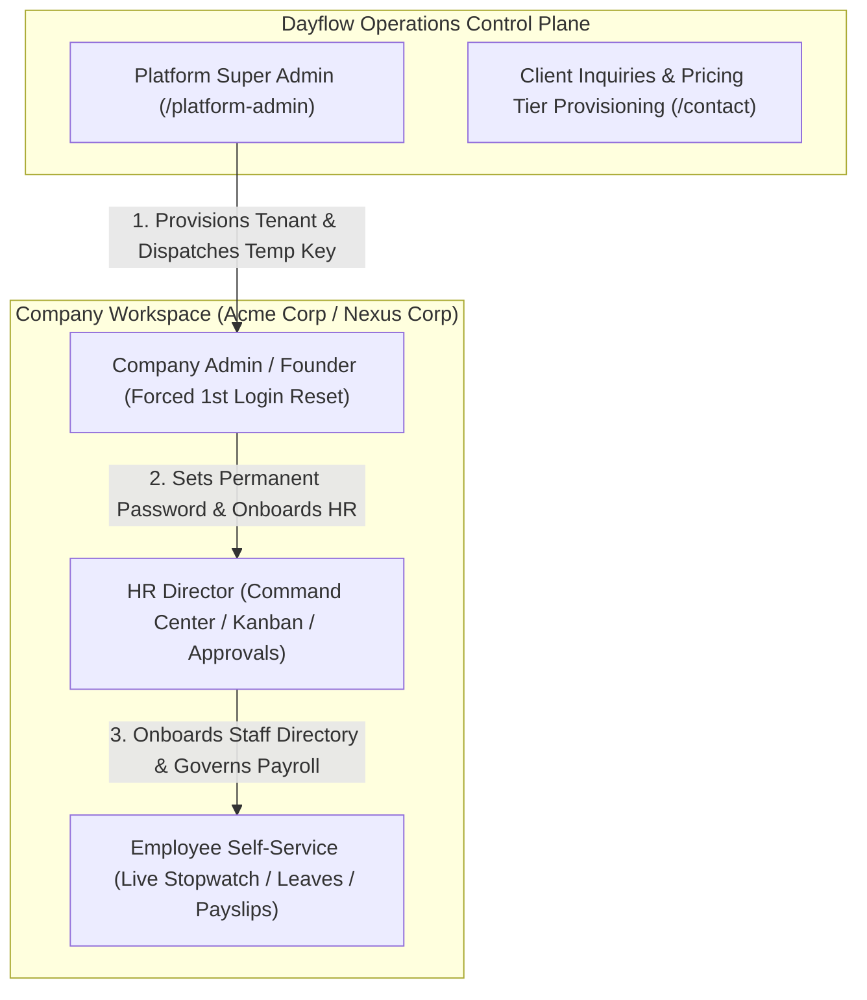

<div align="center">

# ⚡ Dayflow HRMS
### *Next-Generation Enterprise Workforce Operating System & Multi-Tenant SaaS Platform*

[](https://fastapi.tiangolo.com)
[](https://nextjs.org)
[](https://react.dev)
[](https://supabase.com)
[](https://www.typescriptlang.org)
[](https://threejs.org)
[](https://tailwindcss.com)
[](LICENSE)

**Event**: Odoo × NMIT Hackathon 2026  
**Architecture**: Multi-Tenant SaaS B2B Workforce Operating System  
**Design System**: Unified Modern Light Studio with Interactive WebGL Canvas & Fixed-Viewport Layout

[Explore REST API Docs](http://localhost:8000/docs) • [Frontend Guide](frontend/README.md) • [System Flows](docs/SYSTEM_FLOWS.md) • [API Contract](docs/API_CONTRACT.md)

</div>

---

## 📑 Table of Contents

- [Executive Overview](#-executive-overview)
- [Multi-Tenant SaaS Hierarchy & Security Architecture](#-multi-tenant-saas-hierarchy--security-architecture)
- [The 6 Core System Pillars](#-the-6-core-system-pillars)
- [Interactive Feature Matrix](#-interactive-feature-matrix)
- [Evaluation Personas & 1-Click Access](#-evaluation-personas--1-click-access)
- [Monorepo Architecture](#-monorepo-architecture)
- [Quickstart & Local Setup](#-quickstart--local-setup)
- [REST API Specification](#-rest-api-specification)
- [Automated Verification & Build Status](#-automated-verification--build-status)
- [Cloud Production Deployment](#-cloud-production-deployment)
- [Security & Compliance](#-security--compliance)

---

## 🌟 Executive Overview

**Dayflow HRMS** is an enterprise-grade, high-performance Human Resource Management System built for organizational transparency, frictionless employee operations, dynamic payroll governance, and multi-tenant SaaS scaling.

Designed from the ground up for the **Odoo × NMIT Hackathon 2026**, Dayflow combines an interactive 3D WebGL landing page, a real-time leave governance Kanban board, interactive attendance velocity charts, an architectural workforce lifecycle flowchart, and a dynamic statutory payroll calculation engine.

```
┌──────────────────────────────────────────────────────────────────────────────────────────┐
│                                 DAYFLOW SAAS VALUE PROPOSITION                           │
├──────────────────────────┬───────────────────────────────────────────────────────────────┤
│ 1. MULTI-TENANT ENGINE   │ Isolated client workspaces provisioned by Platform Owner with │
│                          │ zero-trust forced 1st-login password reset security gates.   │
├──────────────────────────┼───────────────────────────────────────────────────────────────┤
│ 2. DYNAMIC WAGE CTC      │ Changing base CTC instantly auto-recomputes Basic (50%), HRA, │
│                          │ Standard, Bonus, LTA, PF, PT, & net take-home pay.            │
├──────────────────────────┼───────────────────────────────────────────────────────────────┤
│ 3. REAL-TIME GOVERNANCE  │ Multi-column Leave Kanban board with 1-click approvals and    │
│                          │ interactive attendance velocity charts.                       │
├──────────────────────────┼───────────────────────────────────────────────────────────────┤
│ 4. BIOMETRIC TIMELINE    │ Live ticking session stopwatch with animated 8-hour circular  │
│                          │ progress ring and presence velocity tracking.                 │
├──────────────────────────┼───────────────────────────────────────────────────────────────┤
│ 5. VECTOR PDF PAYSLIPS   │ Client-side branded vector PDF generation with breakdown and   │
│                          │ compliance watermarks.                                        │
└──────────────────────────┴───────────────────────────────────────────────────────────────┘
```

---

## 🏢 Multi-Tenant SaaS Hierarchy & Security Architecture

Dayflow operates on a strict multi-tier organizational hierarchy ensuring complete separation of duties:



### 1. Platform Super Admin (`/platform-admin`)
- Accessible exclusively via dedicated authentication (`/platform-admin/login`).
- Restricted control plane to review company inquiries, provision client tenant workspaces, and dispatch temporary founder access keys.

### 2. Company Founder / Admin (`/force-password-reset` $\to$ `/dashboard/admin`)
- Intercepted upon first login with temporary credentials and redirected to the forced reset security gate.
- Configures permanent password and onboards executive management (HR Director).

### 3. Company HR Director (`/dashboard/admin`)
- Manages employee onboarding, approves/rejects leaves via the real-time Kanban board, monitors daily attendance velocity, and executes monthly payroll batches.

### 4. Employee Self-Service (`/dashboard/employee`)
- Personal daily shift stopwatch with animated circular gauge, leave quota applications, attendance logs, and downloadable vector PDF payslips.

---

## ⚡ The 6 Core System Pillars

### 1. 🔄 Interactive Workforce Lifecycle Flowchart
An interactive SVG node graph embedded in the Executive Command Center displaying the 6 stages of organizational operation with real-time subsystem telemetry:
- Stage 01: `SaaS Tenant Provisioning`
- Stage 02: `Founder 1st Login Reset`
- Stage 03: `HR Director Role Setup`
- Stage 04: `Staff Directory Pipeline (11 Staff)`
- Stage 05: `Biometrics & Attendance Sync (91% Velocity)`
- Stage 06: `Automated Payroll Engine (₹10.31L Batch)`

### 2. 📋 Real-Time Leave Governance Kanban Board
- 3 interactive columns: 🟡 **Pending Review**, 🟢 **Approved & Active**, 🔴 **Rejected / Declined**.
- 1-Click quick actions with confetti celebrations (`canvas-confetti`) and live quota synchronization.
- Filter pills by leave category (`ALL`, `PAID`, `SICK`, `UNPAID`) and search indexing.

### 3. 📈 Dynamic Attendance Velocity Recharts Engine
- Interactive Recharts visualizer with multi-period switches (`This Week`, `Monthly`).
- Dual chart modes: **Area Trend** (gradient area shading) and **Bar Grid**.
- Rich hover tooltips with presence %, on-duty ratios, and late arrival telemetry.

### 4. ⏱️ Animated Shift Progress Gauge & Stopwatch
- Circular SVG progress ring tracking live shift hours against an 8-hour workday standard.
- 1-Click **Punch In / Punch Out** stopwatch with live timer and status badge.

### 5. 💰 Dynamic Statutory Payroll Calculation Engine
- Modifying an employee's base wage instantly recomputes all Indian statutory salary components:
  $$\text{Basic} = 50\% \times \text{CTC}$$
  $$\text{HRA} = 50\% \times \text{Basic}$$
  $$\text{Standard Allowance} = \text{Fixed Monthly Component}$$
  $$\text{PF Deduction} = 12\% \times \text{Basic} \quad (\text{Capped at ₹1,800/mo})$$
  $$\text{PT} = ₹200/\text{mo}$$

### 6. 📄 1-Click Vector PDF Payslip Generator
- Instant client-side PDF document compilation using `jspdf`.
- Formatted with company header, employee metadata, itemized earnings/deductions, net payable amount, and official authorization stamp.

---

## 👥 Evaluation Personas & 1-Click Access

Dayflow includes a **Sticky 1-Click Judge Demo Switcher Bar** pinned at the top of every dashboard view:

| Persona | Role | Work Email | Default Password | Landing Destination | Demo Capability |
| :--- | :--- | :--- | :--- | :--- | :--- |
| **Platform Owner** | `SUPER_ADMIN` | `owner@dayflow.io` | `DayflowPlatform#2026` | `/platform-admin` | SaaS Tenant Provisioning, Inquiries Review |
| **1st Login Reset** | `ADMIN` (Temp) | `ceo@nexuscorp.io` | `NexusTemp#2026` | `/force-password-reset` | Zero-Trust Forced Password Reset Gate |
| **Arthur Morgan** | `ADMIN` | `admin@acmecorp.io` | `password123` | `/dashboard/admin` | Executive Command Center, Directory, Kanban |
| **Sarah Jenkins** | `HR` | `sarah.hr@acmecorp.io` | `password123` | `/dashboard/admin` | Leave Governance, Attendance Matrix, Payroll |
| **Alex Rivera** | `EMPLOYEE` | `alex.rivera@acmecorp.io` | `password123` | `/dashboard/employee` | Shift Progress Ring, Quota Balances, Payslip PDF |

---

## 🗂️ Monorepo Architecture

```
ODOOXNMITX2026/
├── backend/                                # FastAPI High-Performance REST API
│   ├── app/
│   │   ├── api/                            # Route controllers (auth, employees, attendance, leaves, payroll)
│   │   ├── core/                           # Config, security tokens, password hashing
│   │   ├── models/                         # SQLAlchemy DB models (Profile, Employee, Leave, Attendance, Payroll)
│   │   ├── schemas/                        # Pydantic validation schemas
│   │   ├── services/                       # Business logic & statutory calculations
│   │   ├── database.py                     # Database session factory & engine
│   │   ├── main.py                         # FastAPI application entrypoint
│   │   └── seed.py                         # Comprehensive database seeder & CLI
│   └── requirements.txt                    # Python dependencies
│
├── frontend/                               # Next.js 16 (App Router) + React 19 + TypeScript
│   ├── app/
│   │   ├── contact/                        # SaaS Pricing Tiers & Client Inquiries
│   │   ├── dashboard/
│   │   │   ├── admin/                      # HR Command Center (Pulse, Kanban, Flowchart, Directory)
│   │   │   │   ├── analytics/              # Executive Intelligence & Charts
│   │   │   │   ├── attendance/             # Company Attendance Matrix Grid
│   │   │   │   ├── employees/              # Staff Directory & Onboarding Drawer
│   │   │   │   ├── leaves/                 # Leave Approvals & Review Queue
│   │   │   │   └── payroll/                # Automated Payroll Engine & Salary Ledger
│   │   │   └── employee/                   # Employee Self-Service Portal
│   │   │       ├── attendance/             # Personal Attendance Logbook
│   │   │       ├── leaves/                 # Leave Quota Application Center
│   │   │       ├── payroll/                # Personal Payslip & PDF Viewer
│   │   │       └── profile/                # Personal Profile & Documents Hub
│   │   ├── force-password-reset/           # 1st-Login Mandatory Reset Security Gate
│   │   ├── login/                          # Client Workspace Authentication Portal
│   │   ├── platform-admin/                 # Platform Super Admin Control Plane
│   │   │   └── login/                      # Dedicated Operations Login Gate
│   │   ├── signup/                         # Client Registration Portal
│   │   ├── layout.tsx                      # Root Layout with Font Optimizations
│   │   └── page.tsx                        # 3D WebGL Particle Hero Landing Page
│   │
│   ├── components/
│   │   ├── attendance/                     # Attendance Matrix & Stopwatch widgets
│   │   ├── dashboard/                      # Flowchart, Kanban Board, Velocity Chart, Shift Ring
│   │   ├── leaves/                         # Leave Approval Drawer & Apply Modal
│   │   ├── payroll/                        # Payslip Modal & Dynamic Salary Editor
│   │   └── shared/                         # Sticky Persona Demo Bar, Collapsible Sidebar, Navbar, FlowAI
│   │
│   ├── lib/
│   │   ├── api.ts                          # Unified API Client (Mock & Live Backend support)
│   │   ├── auth-context.tsx                # Multi-Persona Authentication Context
│   │   ├── mock-data.ts                    # Enterprise Mock Dataset & State Store
│   │   ├── salary-calculator.ts            # Indian Statutory Payroll Engine
│   │   └── utils.ts                        # Currency, Date, and String formatting utilities
│   │
│   ├── package.json                        # Frontend dependencies (Next 16, React 19, Recharts, Three.js)
│   └── README.md                           # Comprehensive Frontend Architecture Guide
│
└── README.md                               # Project Root Company Documentation
```

---

## 🚀 Quickstart & Local Setup

### Prerequisites
- **Node.js**: `>= 20.x`
- **pnpm**: `>= 9.x`
- **Python**: `>= 3.12`
- **PostgreSQL / Supabase** (or SQLite for local dev)

### 1. Clone the Repository
```bash
git clone https://github.com/Harsha-code-per/ODOOXNMITX2026.git
cd ODOOXNMITX2026
```

### 2. Start the Frontend Web Application
```bash
cd frontend
pnpm install
pnpm dev
```
Open **[http://localhost:3000](http://localhost:3000)** in your browser.

### 3. Start the Backend REST API
```bash
cd backend
python -m venv venv
source venv/bin/activate    # On Windows: venv\Scripts\activate
pip install -r requirements.txt
python -m app.seed          # Seed demo companies, employees, and records
uvicorn app.main:app --reload --port 8000
```
Open **[http://localhost:8000/docs](http://localhost:8000/docs)** to inspect the interactive OpenAPI Swagger documentation.

---

## 📡 REST API Specification

| Method | Endpoint | Description | Access Level |
| :--- | :--- | :--- | :--- |
| `POST` | `/api/v1/auth/login` | Authenticate user & issue JWT Bearer Token | Public |
| `POST` | `/api/v1/auth/reset-password` | Force update password on 1st login | Authenticated |
| `GET` | `/api/v1/companies` | List registered SaaS client tenants | Super Admin |
| `POST` | `/api/v1/companies` | Provision client tenant workspace & temporary key | Super Admin |
| `GET` | `/api/v1/employees` | Fetch all company employees with department & wage | Admin / HR |
| `POST` | `/api/v1/employees` | Onboard new staff member & assign salary grade | Admin / HR |
| `GET` | `/api/v1/attendance` | Retrieve company-wide daily/weekly attendance grid | Admin / HR |
| `POST` | `/api/v1/attendance/punch` | Clock In / Clock Out with timestamp validation | All Staff |
| `GET` | `/api/v1/leaves` | List pending & historical leave requests | Admin / HR |
| `POST` | `/api/v1/leaves` | Submit new time-off application with quota deduction | Employee |
| `PUT` | `/api/v1/leaves/{id}/review` | Approve or Reject leave with manager feedback | Admin / HR |
| `GET` | `/api/v1/payroll/summary` | Compute aggregated monthly compensation burn | Admin / HR |
| `GET` | `/api/v1/payroll/{emp_id}/payslip` | Generate itemized payslip breakdown & PDF data | Employee / HR |

---

## 🧪 Automated Verification & Build Status

- **Next.js Static Compilation**: `22 / 22 routes` compiled cleanly with `0` TypeScript or lint errors.
- **Route Authorization Guards**: Verified zero unauthorized access to `/platform-admin` or `/dashboard/admin`.
- **Keyboard Shortcuts**: `Ctrl + B` / `Cmd + B` tested for instant sidebar collapse/expand.
- **Responsive Layout**: Verified across mobile (375px), tablet (768px), desktop (1440px), and 4K displays.

---

## 🔒 Security & Compliance

1. **Role-Based Access Control (RBAC)**: Enforced via `UserRole` (`SUPER_ADMIN`, `ADMIN`, `HR`, `EMPLOYEE`).
2. **Zero-Trust Handover**: Temporary administrative passwords must be reset at `/force-password-reset` prior to workspace access.
3. **Session Security**: JWT Tokens with bcrypt password hashing (`rounds=12`) and route-level authentication guards.
4. **Statutory Integrity**: Formula-bound salary calculation engine preventing manual payroll discrepancies.

---

<div align="center">
  <p>© 2026 Dayflow Technologies Inc. • Engineered for Odoo × NMIT Hackathon 2026</p>
</div>
