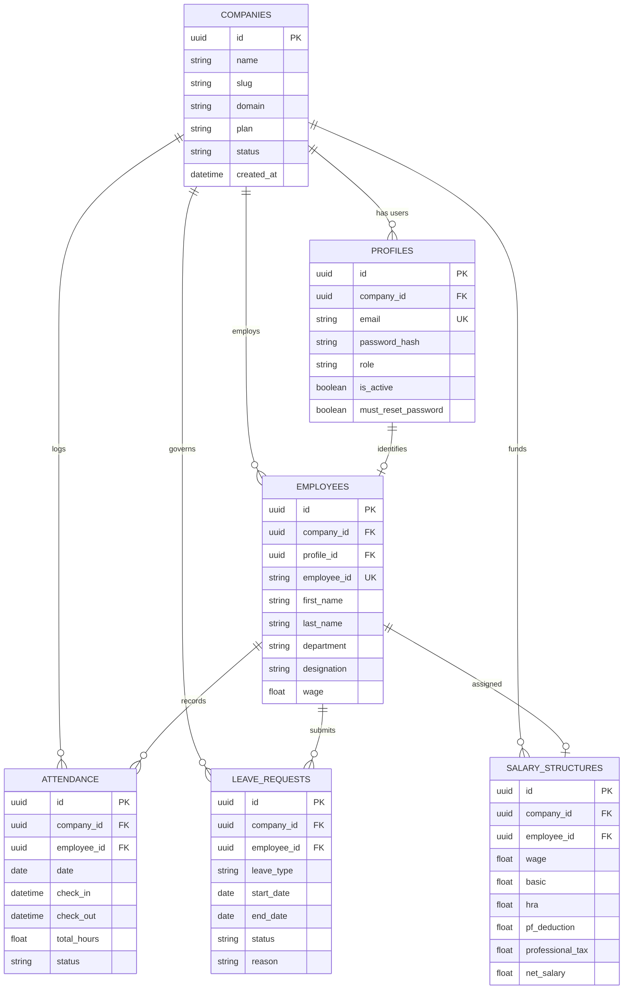

<div align="center">

# ⚡ Dayflow HRMS — FastAPI Async Backend
### *Enterprise Multi-Tenant REST API & Statutory Payroll Governance Engine*

[](https://dayflow-api-mnu6.onrender.com/docs)
[](https://fastapi.tiangolo.com)
[](https://docs.sqlalchemy.org)
[](https://www.postgresql.org)
[](https://alembic.sqlalchemy.org)
[](https://docs.pydantic.dev)
[](tests/)

<br/>

**Architecture**: Multi-Tenant SaaS Async Engine with Row-Level Isolation  
**Database**: PostgreSQL 16 Managed Instance / SQLite local fallback  
**Production URL**: [https://dayflow-api-mnu6.onrender.com](https://dayflow-api-mnu6.onrender.com)  
**Swagger API Docs**: [https://dayflow-api-mnu6.onrender.com/docs](https://dayflow-api-mnu6.onrender.com/docs)

</div>

---

## 📑 Table of Contents

- [🌟 Architectural Overview](#-architectural-overview)
- [🏛️ Multi-Tenant Relational Data Model](#️-multi-tenant-relational-data-model)
- [⚙️ Core Backend Services](#️-core-backend-services)
- [📊 Dynamic Statutory Payroll Formula](#-dynamic-statutory-payroll-formula)
- [🔐 Zero-Trust Security & RBAC](#-zero-trust-security--rbac)
- [🧪 Automated Test Suite & E2E Verification](#-automated-test-suite--e2e-verification)
- [🚀 Quickstart & Local Setup](#-quickstart--local-setup)
- [🗄️ Alembic Database Migration Guide](#️-alembic-database-migration-guide)
- [🐳 Production Docker & Render Deployment](#-production-docker--render-deployment)
- [📡 Complete API Route Specification](#-complete-api-route-specification)

---

## 🌟 Architectural Overview

The **Dayflow Backend** is an asynchronous, high-throughput REST API engineered with **FastAPI**, **SQLAlchemy 2.0 (Async)**, **asyncpg**, **Pydantic v2**, and **PyJWT**.

Key architectural guarantees:
1. **Multi-Tenant Row-Level Isolation**: Every query across employees, attendance, leaves, and payroll is scoped by `company_id`.
2. **Dynamic Statutory Payroll**: Updating an employee's base CTC instantly cascades across Basic (50%), HRA, Allowances, PF (12%), PT (₹200), and Net Take-Home pay.
3. **Attendance State Machine**: Clock-in duplicate prevention, auto-computation of duration hours, and auto-marking half-day vs full-day presence.
4. **Automated Leave Governance**: 1-click approvals that update leave status and synchronize attendance records.
5. **Platform Super Admin Plane**: Multi-tenant workspace provisioning, client inquiry queue, and temporary access key generation.

---

## 🏛️ Multi-Tenant Relational Data Model



---

## ⚙️ Core Backend Services

### 1. Dynamic Payroll Service ([`app/services/payroll_service.py`](app/services/payroll_service.py))
- Computes complete statutory breakdown given base annual or monthly CTC.
- Itemizes Basic (50%), HRA (25%), Standard Allowance (up to ₹4,166.67), Performance Bonus (8.33%), LTA (8.33%), Fixed Allowance (balancing sum), Provident Fund (12% of Basic), and Professional Tax (₹200).
- Calculates attendance-adjusted payout based on working days vs unpaid absences.

### 2. Email Delivery Service ([`app/services/email_service.py`](app/services/email_service.py))
- Integrates with **Resend API** for transactional email delivery.
- Dispatches tenant activation links, temporary password notices, and leave approval notifications.
- Automatic secret masking and resilient offline fallback logging when API keys are unconfigured.

### 3. Startup Auto-Seeder ([`app/main.py`](app/main.py) & [`app/seed.py`](app/seed.py))
- Executed on container startup to automatically initialize tables and seed 11 complete demo personas if the database is empty.

---

## 📊 Dynamic Statutory Payroll Formula

$$\text{Gross Wage (CTC)} = \text{Basic} + \text{HRA} + \text{Standard} + \text{Bonus} + \text{LTA} + \text{Fixed Allowance}$$

$$\text{Basic Salary} = 50\% \times \text{CTC}$$

$$\text{HRA} = 50\% \times \text{Basic} = 25\% \times \text{CTC}$$

$$\text{Standard Allowance} = \min(₹4,166.67, \text{CTC} - \text{Basic} - \text{HRA})$$

$$\text{Provident Fund (PF)} = 12\% \times \text{Basic}$$

$$\text{Professional Tax (PT)} = ₹200.00/\text{month}$$

$$\text{Net Take-Home Pay} = \text{Gross Wage} - \text{PF} - \text{PT}$$

---

## 🔐 Zero-Trust Security & RBAC

- **Password Hashing**: Industry-standard `bcrypt` with automatic salt generation.
- **JWT Issuance**: Signed with `HS256`, containing `sub` (user profile ID), `role` (`SUPER_ADMIN`, `ADMIN`, `HR`, `EMPLOYEE`), and `company_id`.
- **First-Login Gate**: Users created by provisioning or onboarding are tagged with `must_reset_password: true`. FastAPI middleware blocks access to core APIs until `POST /api/v1/auth/change-password` is executed.
- **Role Enforcement**: Negative RBAC checks prevent privilege escalation (e.g. HR cannot create ADMIN accounts; employees cannot view company-wide attendance).

---

## 🧪 Automated Test Suite & E2E Verification

### 1. Pytest Test Suite (35/35 Green)
```bash
# Run unit & integration tests
uv run pytest
```
Covers:
- `test_api_endpoints.py` — Authentication, attendance punch, leave requests, employee directory.
- `test_dynamic_payroll.py` — Indian statutory CTC recalculation at 50k, 60k, 75k, 90k, 150k wages.
- `test_email_service.py` — Resend API integration, secret sanitization, and fallback delivery.
- `test_tenant_isolation.py` — Multi-tenant query boundary enforcement.
- `test_super_admin.py` — Tenant provisioning, inquiry handling, and status toggles.

### 2. 7-Stage Real-Data SaaS Lifecycle Script
```bash
# Run the complete real-data E2E verification
uv run python scripts/e2e_real_data_flow.py
```
Executes all 7 stages against live database tables:
1. Lead Submission (`POST /inquiries`)
2. Super Admin Provisioning (`POST /super-admin/companies`)
3. Founder 1st-Login Password Reset (`POST /auth/change-password`)
4. Staff Onboarding & Wage Setup (`POST /auth/register`)
5. Biometric Clock-In/Out (`POST /attendance/check-in`)
6. Leave Application & Kanban Approval (`PATCH /leaves/{id}/approve`)
7. Executive Intelligence Telemetry (`GET /analytics/dashboard`)

---

## 🚀 Quickstart & Local Setup

```bash
# 1. Navigate to backend directory
cd backend

# 2. Install dependencies with uv
uv sync

# 3. Copy environment configuration
cp .env.example .env

# 4. Run database migrations
uv run alembic upgrade head

# 5. Seed database with demo personas
uv run python -m app.seed

# 6. Start development server
uv run uvicorn app.main:app --reload --port 8000
```
- Swagger UI: `http://localhost:8000/docs`
- ReDoc: `http://localhost:8000/redoc`
- Health: `http://localhost:8000/health`

---

## 🗄️ Alembic Database Migration Guide

```bash
# Apply all pending migrations to latest schema
uv run alembic upgrade head

# Inspect current schema revision
uv run alembic current

# Generate new migration based on SQLAlchemy models
uv run alembic revision --autogenerate -m "add_new_feature_table"

# Roll back by 1 revision
uv run alembic downgrade -1
```

---

## 🐳 Production Docker & Render Deployment

The backend is packaged as a lightweight Docker container built on `python:3.12-slim` with Astral's `uv`:

```dockerfile
# backend/Dockerfile
FROM python:3.12-slim
WORKDIR /app
COPY --from=ghcr.io/astral-sh/uv:latest /uv /bin/uv
COPY pyproject.toml uv.lock ./
RUN uv sync --frozen --no-dev
COPY alembic.ini ./
COPY alembic/ ./alembic/
COPY app/ ./app/
EXPOSE 10000 8000
CMD ["sh", "-c", "uv run alembic upgrade head && uv run uvicorn app.main:app --host 0.0.0.0 --port ${PORT:-10000}"]
```

### Production Environment Variables on Render:
- `DATABASE_URL`: `postgresql+asyncpg://...`
- `JWT_SECRET_KEY`: `<32+ random characters>`
- `CORS_ORIGINS`: `["https://dayflow-hrms-chi.vercel.app","http://localhost:3000"]`
- `APP_BASE_URL`: `https://dayflow-hrms-chi.vercel.app`

---

## 📡 Complete API Route Specification

```
Tag             Method   Endpoint                               Description
─────────────────────────────────────────────────────────────────────────────────────────────
Auth            POST     /api/v1/auth/login                     Authenticate & issue JWT token
Auth            POST     /api/v1/auth/change-password           Change password / 1st-login reset
Auth            POST     /api/v1/auth/forgot-password           Trigger password recovery email
Auth            POST     /api/v1/auth/register                  Onboard employee into tenant
Auth            GET      /api/v1/auth/me                        Get current authenticated user profile
│
Super Admin     GET      /api/v1/super-admin/companies          List all tenant workspaces
Super Admin     POST     /api/v1/super-admin/companies          Provision new tenant workspace
Super Admin     PATCH    /api/v1/super-admin/companies/{id}/status Toggle workspace status
Super Admin     GET      /api/v1/super-admin/inquiries          List enterprise client leads
Super Admin     PATCH    /api/v1/super-admin/inquiries/{id}/status Update inquiry status
│
Inquiries       POST     /api/v1/inquiries                      Public lead intake from /contact
│
Employees       GET      /api/v1/employees/me                   Get employee self profile
Employees       GET      /api/v1/employees                      List tenant staff directory
Employees       GET      /api/v1/employees/{id}                 Get employee detail by ID
Employees       PUT      /api/v1/employees/{id}                 Update employee master record
│
Attendance      POST     /api/v1/attendance/check-in            Record daily clock-in timestamp
Attendance      POST     /api/v1/attendance/check-out           Record daily clock-out timestamp
Attendance      GET      /api/v1/attendance/me                  Get employee personal attendance
Attendance      GET      /api/v1/attendance                     Get company-wide attendance grid
│
Leaves          POST     /api/v1/leaves                         Submit time-off application
Leaves          GET      /api/v1/leaves/me                      Get personal leave balances & log
Leaves          GET      /api/v1/leaves                         Get company leave approval queue
Leaves          PATCH    /api/v1/leaves/{id}/approve            Approve leave request (HR/Admin)
Leaves          PATCH    /api/v1/leaves/{id}/reject             Reject leave request (HR/Admin)
│
Payroll         GET      /api/v1/payroll/me                     Get employee personal payslip
Payroll         GET      /api/v1/payroll/{id}                   Get employee statutory breakdown
Payroll         PUT      /api/v1/payroll/{id}/salary            Update base CTC & auto-recompute
│
Analytics       GET      /api/v1/analytics/dashboard            Get live executive telemetry KPIs
Notifications   GET      /api/v1/notifications                  Get user in-app notifications
```

---

<div align="center">

**Dayflow HRMS Backend** • Powering Enterprise Workforce Operations

</div>
