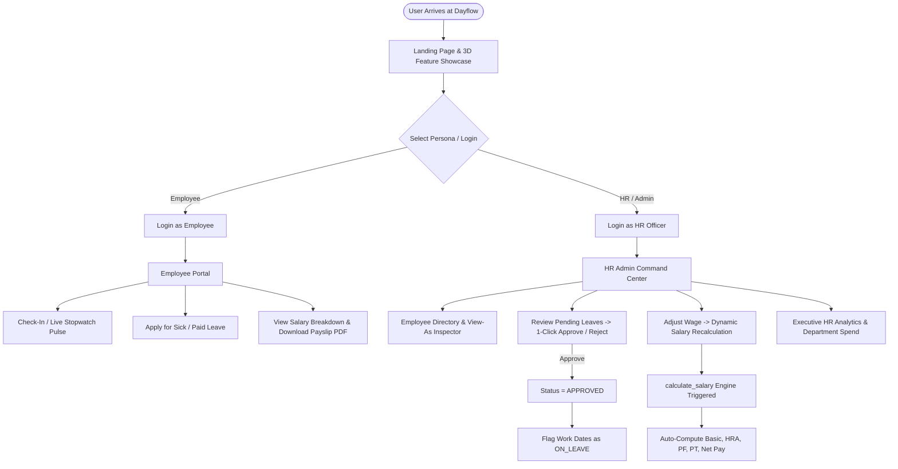
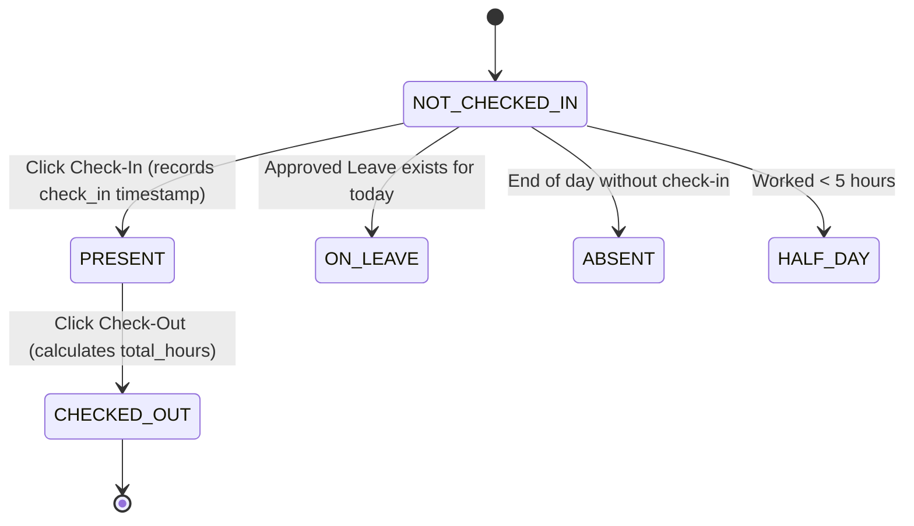
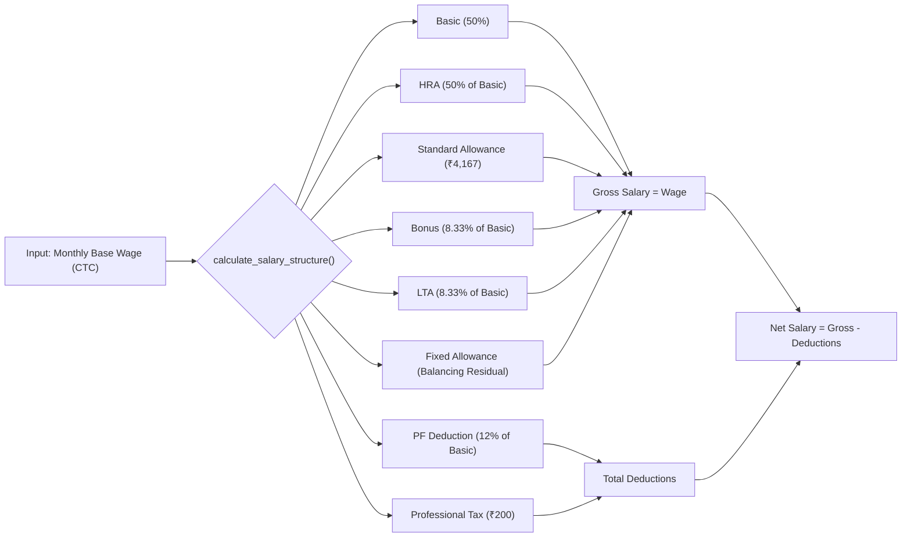

# Dayflow HRMS — System Flows & Architecture Blueprints

---

## 1. End-to-End User & Business Flow

```mermaid
flowchart TD
    Start([User Arrives at Dayflow]) --> Landing[Landing Page & 3D Feature Showcase]
    Landing --> AuthChoice{Select Persona / Login}
    
    AuthChoice -->|Employee| EmpAuth[Login as Employee]
    AuthChoice -->|HR / Admin| HRAuth[Login as HR Officer]
    
    EmpAuth --> EmpDash[Employee Portal]
    EmpDash --> CheckIn[Check-In / Live Stopwatch Pulse]
    EmpDash --> ApplyLeave[Apply for Sick / Paid Leave]
    EmpDash --> ViewSalary[View Salary Breakdown & Download Payslip PDF]
    
    HRAuth --> HRDash[HR Admin Command Center]
    HRDash --> ViewStaff[Employee Directory & View-As Inspector]
    HRDash --> ReviewLeaves[Review Pending Leaves -> 1-Click Approve / Reject]
    HRDash --> ManagePayroll[Adjust Wage -> Dynamic Salary Recalculation]
    HRDash --> ViewAnalytics[Executive HR Analytics & Department Spend]
    
    ReviewLeaves -->|Approve| UpdateLeaveStatus[Status = APPROVED]
    UpdateLeaveStatus --> SyncAttendance[Flag Work Dates as ON_LEAVE]
    
    ManagePayroll --> Recalc[calculate_salary Engine Triggered]
    Recalc --> UpdatePayslips[Auto-Compute Basic, HRA, PF, PT, Net Pay]
```

---

## 2. Attendance State Machine

```mermaid
stateDiagram-v2
    [*] --> NOT_CHECKED_IN
    NOT_CHECKED_IN --> PRESENT: Click Check-In (records check_in timestamp)
    PRESENT --> CHECKED_OUT: Click Check-Out (calculates total_hours)
    CHECKED_OUT --> [*]
    
    NOT_CHECKED_IN --> ON_LEAVE: Approved Leave exists for today
    NOT_CHECKED_IN --> ABSENT: End of day without check-in
    NOT_CHECKED_IN --> HALF_DAY: Worked < 5 hours
```

---

## 3. Dynamic Salary Recalculation Engine Flow

```mermaid
flowchart LR
    InputWage["Input: Monthly Base Wage (CTC)"] --> Engine{"calculate_salary_structure()"}
    
    Engine --> Basic["Basic (50%)"]
    Engine --> HRA["HRA (50% of Basic)"]
    Engine --> Std["Standard Allowance (₹4,167)"]
    Engine --> Bonus["Bonus (8.33% of Basic)"]
    Engine --> LTA["LTA (8.33% of Basic)"]
    Engine --> Fixed["Fixed Allowance (Balancing Residual)"]
    
    Engine --> PF["PF Deduction (12% of Basic)"]
    Engine --> PT["Professional Tax (₹200)"]
    
    Basic & HRA & Std & Bonus & LTA & Fixed --> Gross["Gross Salary = Wage"]
    PF & PT --> Ded["Total Deductions"]
    
    Gross & Ded --> Net["Net Salary = Gross - Deductions"]
```
